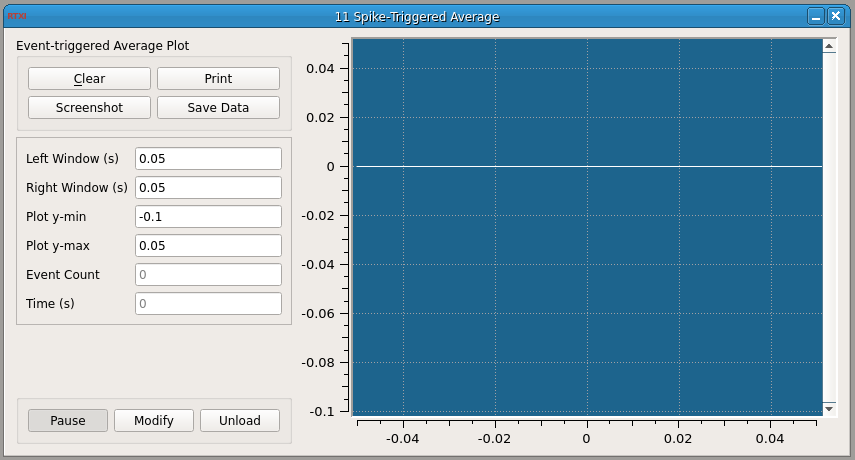

###Spike-Triggered Average

**Requirements:** Qwt, Spike Detector plugin, Plot helper classes (included), Boost libraries
**Limitations:** None noted



This module computes an event or spike-triggered average of any input signal. You specify a time window of interest around the spike. This screenshot was made using a neuron model to generate spikes and the SpikeDetect module to detect spikes. The STA module then plots the average spike shape waveform is plotted.

To install the Boost libraries in Ubuntu:
````
$ sudo apt-get install libboost-dev
````

####Input Channels
1. input(0) – “Input” : Quantity to compute the spike-triggered average for
2. input(1) – “Event Trigger” : trigger that indicates the spike time/event (=1)

####Output Channels
1. output(0) – “Isyn” : Output current (A)

####Parameters
1. Left Window (s) : Amount of time before the spike to include in average
2. Right Window (s) : Amount of time after the spike to include in average
3. Plot y-min : Minimum for y-axis on the plot
4. Plot y-max : Maximum for y-axis on the plot

####States
1. Event Count : Number of spikes (events) that are included in the current average

Here is an example of how you can compute the average spike waveform of the [Connor-Stevens model neuron](https://github.com/RTXI/connor-stevens):


